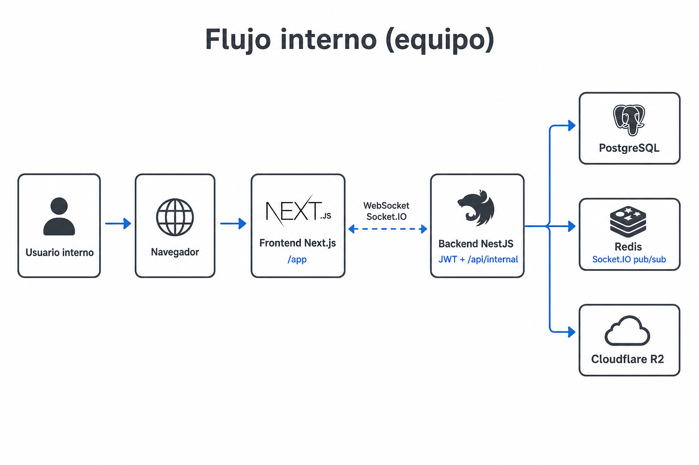
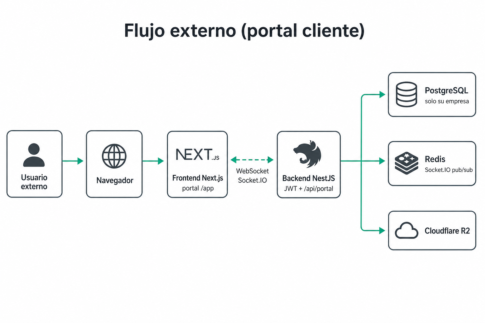

# mia-system

Backend **NestJS**, frontend **Next.js**, PostgreSQL. Todo con Docker.

CRM / gestión de clientes (internal + portal): empresas, proyectos, tickets, cotizaciones, RBAC y tiempo real.

### Flujo de usuario — interno (equipo)

Admin / super_admin / staff → panel `/app` → API `/api/internal/*` (+ auth). Chat y notificaciones en vivo vía Socket.IO; Redis sincroniza réplicas.



### Flujo de usuario — externo (portal cliente)

Cliente vinculado a su empresa → mismo frontend con permisos de portal → API `/api/portal/*`. Solo ve datos de su empresa; tiempo real en tickets/chat del portal.



| | Interno | Externo |
|--|---------|---------|
| Quién | Equipo (admin, super_admin, …) | Cliente de una empresa |
| API | `/api/internal/*` | `/api/portal/*` |
| Alcance datos | Multi-empresa / operación completa según RBAC | Solo su empresa (`users_companies`) |
| Tiempo real | Tickets, presencia, notificaciones | Tickets/chat y avisos de su ámbito |

### Documentación

| Documento | Contenido |
|-----------|-----------|
| [`docs/REQUERIMIENTOS.md`](docs/REQUERIMIENTOS.md) | Requisitos previos (Docker), negocio, módulos |
| [`docs/ARQUITECTURA-BACKEND.md`](docs/ARQUITECTURA-BACKEND.md) | API, auth/RBAC, errores, R2 |
| [`docs/ARQUITECTURA-FRONTEND.md`](docs/ARQUITECTURA-FRONTEND.md) | Next.js, pages/components, API client |
| [`docs/ARQUITECTURA-TESTS.md`](docs/ARQUITECTURA-TESTS.md) | Tests unit / api / integration |
| [`backend/BD/README.md`](backend/BD/README.md) | Migraciones y seeds |

---

## Levantar

```bash
cp .env.example .env          # solo la primera vez
docker compose down
docker compose up --build
```

Otra terminal (primera vez o tras `down -v`):

```bash
docker compose exec api pnpm run migrate
docker compose exec api pnpm run migrate:data
```

| URL | Servicio |
|-----|----------|
| http://localhost:3000/api/reference | Scalar (API) |
| http://localhost:3001 | Frontend |
| http://localhost:3000/api | API REST |

Requisitos de máquina (Docker Windows/Linux): ver inicio de [`docs/REQUERIMIENTOS.md`](docs/REQUERIMIENTOS.md).  
Usuarios seed: [`backend/BD/README.md`](backend/BD/README.md).

---

## Comandos

| Acción | Comando |
|--------|---------|
| Levantar | `docker compose up --build` |
| Migrar | `docker compose exec api pnpm run migrate` (+ `migrate:data`) |
| Tests | `docker compose exec api pnpm test` |
| Tests auth | `docker compose exec api pnpm test:auth` |
| Tests auth + BD | `docker compose exec api pnpm test:auth:integration` |
| Deps API | `docker compose exec api pnpm install` |
| Deps front | `./frontend/pnpm.sh add <paquete>` |
| Bajar | `docker compose down` |
| Reset BD | `docker compose down -v` |
| Logs | `docker compose logs -f api` |

---

## Repo

```
mia-system/
├── docker-compose.yml
├── .env.example
├── docs/
├── backend/     ← NestJS + BD/
└── frontend/    ← Next.js
```

---

## Problemas frecuentes

| Problema | Solución |
|----------|----------|
| Docker no responde | Windows: abrir Docker Desktop. Linux: `sudo systemctl start docker` |
| Permisos (Linux) | `docker run --rm -v "$PWD:/project" alpine:3.22 chown -R $(id -u):$(id -g) /project` |
| Hot reload (Windows) | Proyecto dentro de WSL |
| Módulo no encontrado (API) | `docker compose exec api pnpm install` → `restart api` |
| Scalar 404 | API compiló mal; URL: http://localhost:3000/api/reference |
| SASL / Postgres | `.env`: `DATABASE_URL` alineado con `POSTGRES_*` |
