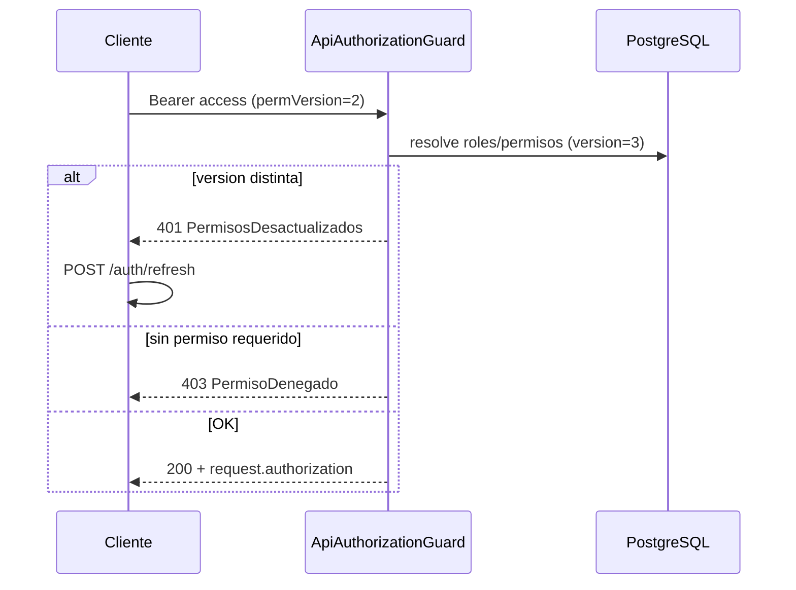

# Arquitectura backend — mia-system

## Enfoque

**NestJS modular por dominio (Feature Modules)** con dos superficies HTTP:

| Superficie | Quién | Prefijo |
|------------|-------|---------|
| **internal** | Equipo (admin, super_admin) | `/api/internal/*` |
| **portal** | Clientes externos | `/api/portal/*` |

Un feature = un módulo con su controller, service, dto, queries y types. Sin ORM. Sin capas extra.

---

## Flujo de una request

```
Cliente HTTP
    ↓
main.ts  →  ValidationPipe (DTO)  +  AppExceptionFilter
    ↓
XxxController  →  recibe DTO / params, delega
    ↓
XxxService  →  reglas de negocio + ejecuta queries (pg)
    ↓
PostgreSQL
```

El **controller no maneja errores**. El **service** lanza excepciones del dominio. Nest + el filter responden en español.

---

## Capas por feature

```
xxx.controller.ts   →  rutas HTTP (/internal/* y /portal/* declaradas en @Controller)
xxx.service.ts      →  lógica de negocio; llama queries con parámetros ($1, $2…)
queries/            →  SQL del dominio (sin concatenar input del usuario)
types/              →  interfaces (Company, filtros, etc.)
dto/                →  entrada API + class-validator (mensajes en español)
exceptions/         →  excepciones a medida del dominio (extienden AppException)
xxx.module.ts       →  registra controller y service
```

Infra compartida: `common/database/DatabaseService` (pool `pg`). Archivos en **Cloudflare R2** vía `common/storage/R2StorageService` (`@aws-sdk/client-s3`). Esquema de tablas en `backend/BD/migration/*.sql`.

### Qué va en cada capa

| Capa | Responsabilidad | No hace |
|------|-----------------|---------|
| **Controller** | Rutas, `@Body()` / `@Param()`, llamar al service | Reglas de negocio, queries SQL |
| **Service** | Validar reglas, ejecutar queries parametrizadas, lanzar excepciones | Conocer HTTP, armar SQL con strings del usuario |
| **queries/** | Sentencias SQL fijas con `$1`, `$2`… | Lógica de negocio |
| **types/** | Interfaces de filas/objetos internos | Validación HTTP |
| **DTO** | Validar forma del request | Lógica de negocio |
| **exceptions/** | Mensajes de error del dominio en español | — |

---

## Errores (español)

### Formato de respuesta

Todas las respuestas de error usan:

```json
{
  "statusCode": 404,
  "mensaje": "Empresa no encontrada"
}
```

Validación con varios campos:

```json
{
  "statusCode": 400,
  "mensaje": ["El nombre es obligatorio", "El RUT es obligatorio"]
}
```

### Infra compartida

| Archivo | Rol |
|---------|-----|
| `common/exceptions/app.exception.ts` | Clase base `AppException` con campo `mensaje` |
| `common/filters/app-exception.filter.ts` | Filter global → formato `{ statusCode, mensaje }` |
| `common/pipes/validation.factory.ts` | ValidationPipe → errores de DTO en español |

### Uso en el service

```typescript
// companies/exceptions/companies.exceptions.ts
export class EmpresaNoEncontradaException extends AppException {
  constructor() {
    super('Empresa no encontrada', HttpStatus.NOT_FOUND);
  }
}

// companies.service.ts
throw new EmpresaNoEncontradaException();
```

Cada feature define sus excepciones en `exceptions/`. No usar strings sueltos con `NotFoundException` de Nest.

---

## Rutas y controllers

Las rutas **internal** y **portal** se declaran en el **mismo feature**, en `xxx.controller.ts`, con `@Controller` distintos:

```typescript
@Controller('internal/companies')
export class InternalCompaniesController { ... }

@Controller('portal/companies')
export class PortalCompaniesController { ... }
```

No hay carpetas `internal/` ni `portal/` dentro del feature. No hay RouterModule ni módulos derivadores.

Prefix global en `main.ts`: `api` → ruta final `/api/internal/companies`.

### Convención GET

Los **GET que necesitan filtros** (id, companyId, etc.) **no usan parámetros en la URL**. Reciben un DTO por **body**:

| Antes | Ahora |
|-------|-------|
| `GET /internal/companies/:id` | `GET /internal/companies/detalle` + body `{ "id": "uuid" }` |
| `GET /internal/companies/:id/representatives` | `GET /internal/companies/representantes` + body `{ "companyId": "uuid" }` |

Los GET de listado sin filtros (`GET /internal/companies`) no llevan body.

`PATCH`, `DELETE` y `POST` con recurso puntual pueden seguir usando `:id` en la URL.

---

## Swagger

Documentación interactiva en **`/api/docs`** (JSON en `/api/docs/json`).

- DTOs con `@ApiProperty` → request body documentado y probabile desde la UI.
- `dto/responses/` → schemas de respuesta.
- `@ApiOperation`, `@ApiBody`, `@ApiOkResponse` en cada endpoint.

Configuración: `common/swagger/setup-swagger.ts`, se llama desde `main.ts`.

---

## Árbol de carpetas (actual + pendiente)

```
backend/src/
├── main.ts                              ← prefix api, ValidationPipe, AppExceptionFilter
├── app.module.ts
│
├── common/
│   ├── database/
│   │   ├── database.module.ts         ← Pool pg (global)
│   │   ├── database.service.ts        ← query(text, params)
│   │   └── database-url.ts            ← DATABASE_URL desde .env
│   ├── exceptions/
│   │   └── app.exception.ts
│   ├── filters/
│   │   └── app-exception.filter.ts
│   ├── pipes/
│   │   └── validation.factory.ts
│   ├── swagger/
│   │   └── setup-swagger.ts           ← /api/docs
│   ├── storage/
│   │   ├── storage.module.ts          ← R2 (S3 API)
│   │   ├── r2-storage.service.ts
│   │   ├── r2.config.ts
│   │   └── r2.types.ts
│   ├── guards/                          ← (pendiente)
│   ├── decorators/                      ← (pendiente)
│   └── types/                           ← (pendiente: auth-user, etc.)
│
├── companies/                           ← ✅ implementado
│   ├── companies.module.ts
│   ├── companies.controller.ts
│   ├── companies.service.ts
│   ├── queries/
│   ├── types/
│   ├── dto/
│   └── exceptions/
│
├── auth/                                ← ✅ login + refresh JWT
│   ├── auth.module.ts
│   ├── auth.controller.ts               → /api/auth/*
│   ├── auth.service.ts
│   ├── auth.config.ts
│   ├── queries/
│   ├── types/
│   ├── dto/
│   └── exceptions/
│
├── users/                               ← (pendiente)
│   ├── users.module.ts
│   ├── users.controller.ts              → /api/internal/users
│   ├── users.service.ts
│   ├── dto/
│   ├── exceptions/
│   ├── queries/
│   └── types/
│
├── assets/                              ← ✅ implementado
│   ├── assets.module.ts
│   ├── assets.controller.ts
│   ├── assets.service.ts
│   ├── queries/
│   ├── types/
│   ├── dto/
│   └── exceptions/
│
├── projects/                            ← ✅ implementado
│   ├── projects.module.ts
│   ├── projects.controller.ts
│   ├── projects.service.ts
│   ├── queries/
│   ├── types/
│   ├── dto/
│   └── exceptions/
│
├── tickets/                             ← ✅ implementado
│   ├── tickets.module.ts
│   ├── tickets.controller.ts
│   ├── tickets.service.ts
│   ├── queries/
│   ├── types/
│   ├── dto/
│   └── exceptions/
│
└── audit/                               ← ✅ implementado (solo internal, lectura)
    ├── audit.module.ts
    ├── audit.controller.ts
    ├── audit.service.ts                  ← log() exportado para conectar después
    ├── queries/
    ├── types/
    ├── dto/
    └── exceptions/
```

---

## Companies (referencia)

### Rutas internal

| Método | Ruta | Body |
|--------|------|------|
| GET | `/api/internal/companies` | — |
| GET | `/api/internal/companies/detalle` | `{ "id": "uuid" }` |
| POST | `/api/internal/companies` | `CreateCompanyDto` |
| PATCH | `/api/internal/companies/:id` | `UpdateCompanyDto` |
| DELETE | `/api/internal/companies/:id` | — (soft: inactive) |
| GET | `/api/internal/companies/representantes` | `{ "companyId": "uuid" }` |
| POST | `/api/internal/companies/:id/representatives` | `LinkRepresentativeDto` |
| DELETE | `/api/internal/companies/:id/representatives/:legalRepresentativeId` | — |
| GET | `/api/internal/legal-representatives` | — |
| GET | `/api/internal/legal-representatives/detalle` | `{ "id": "uuid" }` |
| POST | `/api/internal/legal-representatives` | `CreateLegalRepresentativeDto` |
| PATCH | `/api/internal/legal-representatives/:id` | `UpdateLegalRepresentativeDto` |

---

## Auth (login)

Credenciales **solo por body** (nunca en la URL). Rate limit: **5 intentos/min** en login.

| Método | Ruta | Body |
|--------|------|------|
| POST | `/api/auth/login` | `{ "email", "password" }` |
| POST | `/api/auth/refresh` | `{ "refreshToken" }` |

Respuesta: `accessToken`, `refreshToken`, `expiresIn`, `user` (espejo del payload).

### Payload del access token (`JwtAccessPayload`)

Lo que irá en el JWT y lo leerás en guards/middleware con `AuthService.verifyAccessToken()`:

| Claim | Ejemplo | Uso |
|-------|---------|-----|
| `sub` | uuid | ID del usuario |
| `email` | `cliente@mia.local` | Identidad |
| `firstName` / `lastName` | Cliente / Demo | UI o logs |
| `roles` | `["cliente"]` | Rol(es) |
| `surfaces` | `["portal"]` | internal \| portal |
| `permissions` | `["tickets:read", ...]` | Snapshot para UI (no es fuente de verdad) |
| `permVersion` | `3` | Debe coincidir con `users.permissions_version` en BD |
| `type` | `"access"` | Distinguir de refresh |
| `iat` / `exp` | — | Estándar JWT (automático) |

**No va** contraseña ni datos sensibles. El **refresh token** solo lleva `sub` + `type: "refresh"` (mínimo); al renovar se vuelven a cargar roles/permisos desde BD.

Usuarios de desarrollo (tras `migrate:data`): `admin@mia.local` / `admin`, `cliente@mia.local` / `cliente`.

Variables en `.env`: `JWT_ACCESS_SECRET`, `JWT_REFRESH_SECRET`, `JWT_ACCESS_EXPIRES_IN_PORTAL` (default `12h`, rol cliente), `JWT_ACCESS_EXPIRES_IN_INTERNAL` (default `1d`, admin/super_admin), `JWT_REFRESH_EXPIRES_IN`.

### Autorización (permisos desde BD)

Modelo **híbrido** (estándar en APIs enterprise):

1. **Fuente de verdad**: tablas `roles`, `permissions`, `users_roles`, `roles_permissions`.
2. **En cada request protegida**: `ApiAuthorizationGuard` (global) resuelve permisos desde BD y aplica la política de la ruta.
3. **En el JWT**: snapshot (`roles`, `permissions`, `permVersion`) para UI y para detectar tokens viejos.
4. **Invalidación**: columna `users.permissions_version` + triggers en `users_roles` y `roles_permissions`. Si cambias un rol del usuario o los permisos de un rol, la versión sube.
5. **Token desactualizado**: si `token.permVersion !== BD.permissions_version` → `401` con mensaje *"Renueva la sesión con POST /api/auth/refresh"*. El cliente hace refresh y obtiene permisos nuevos sin re-login.



| Pieza | Archivo |
|-------|---------|
| Guard global (JWT + superficie + permisos) | `auth/guards/api-authorization.guard.ts` |
| Resolver permisos + cache | `auth/permissions/permissions.service.ts` |
| Convención ruta → permiso | `auth/permissions/route-permission.resolver.ts` |
| Decoradores por controller | `@AuthorizeSurface`, `@AuthorizeResource` |
| Rutas públicas | `@Public()` |
| Overrides puntuales | `@AuthorizeAction` o `@RequirePermissions` |
| Migración BD | `BD/migration/auth_authorization.sql` |

### Convención (sin decorar cada endpoint)

En el **controller** (una sola vez):

```typescript
@AuthorizeSurface('internal')
@AuthorizeResource('companies')
@Controller('internal/companies')
export class InternalCompaniesController { ... }
```

El guard infiere el permiso:

| HTTP | Permiso |
|------|---------|
| GET | `{resource}:read` |
| POST | `{resource}:create` |
| PATCH | `{resource}:update` |
| DELETE | `{resource}:delete` |

Rutas compuestas (`comentarios`, `archivos`, `catalogos`, `estado`, …) están centralizadas en `route-permission.resolver.ts` — **un solo archivo** para excepciones, no N controllers.

**Default deny** (patrón edificio-alcazar): si la ruta es `internal/*` o `portal/*` y no se puede resolver permiso → `403 RutaSinPermisoConfigurado`. Sin `@AuthorizeSurface` en controller API → `403 RutaSinAutorizacion`.

Bypass de permisos: `super_admin` o permiso `system:manage`. Usuario activo sin permisos efectivos → `403 UsuarioSinPermisos`.

`@AuthenticatedOnly()` — solo JWT + superficie + versión (p. ej. futuro update-profile).

### Seguridad HTTP y hardening

| Pieza | Archivo / env |
|-------|----------------|
| Helmet (headers) | `common/security/setup-security.ts` |
| CORS | `CORS_ORIGINS` (lista separada por comas) |
| Rate limit global | `ThrottlerGuard` + `THROTTLE_LIMIT` / `THROTTLE_TTL_MS` |
| Login / refresh | `@Throttle` más estricto en `auth.controller.ts` |
| Swagger en prod | `SWAGGER_ENABLED=false` por defecto si `NODE_ENV=production` |
| Trust proxy | `TRUST_PROXY=true` detrás de nginx/load balancer |
| Validación RUT | `common/utils/rut.util.ts` → `companies.service` |
| Validación uploads | `common/utils/upload-validation.util.ts` → `assets.service` |
| Verificar roles/permisos | `GET /api/internal/admin/authorization/verify` (`system:manage`) |

### Guards

| Pieza | Uso |
|-------|-----|
| `ThrottlerGuard` | `APP_GUARD` global (antes del auth guard) |
| `ApiAuthorizationGuard` | `APP_GUARD`: JWT, superficie, permVersion, permisos, default-deny |
| `@Public()` | Omite auth (`/api/auth/*`, health) |

Decorador `@CurrentUser()` / `@CurrentUser('sub')` para leer el payload en controllers.

Rutas `/api/auth/*` y `/` son `@Public()`. El resto exige Bearer + `@AuthorizeSurface` + `@AuthorizeResource` en el controller.

Portal ya **no** envía `userId` en body; se toma del token.

---

### Rutas portal

Todas las rutas portal validan acceso vía JWT (`@CurrentUser('sub')`) y `users_companies` → `projects` → `tickets`.

| Método | Ruta | Auth | Body |
|--------|------|------|------|
| GET | `/api/portal/companies` | Bearer | — |
| GET | `/api/portal/companies/detalle` | Bearer | `{ "id" }` |
| GET | `/api/portal/projects` | Bearer | `{ "companyId"? }` |
| GET | `/api/portal/projects/detalle` | Bearer | `{ "id" }` |
| GET | `/api/portal/tickets` | Bearer | `{ "projectId"? }` |
| GET | `/api/portal/tickets/detalle` | Bearer | `{ "id" }` |
| POST | `/api/portal/tickets` | Bearer | `PortalCreateTicketDto` |
| GET/POST | `/api/portal/tickets/comentarios` | Bearer | `ticketId`, etc. |

Infra: `common/portal/PortalAccessService` (`userHasCompany`, `userHasProject`, `userHasTicket`).

### Excepciones del dominio

| Excepción | HTTP | Mensaje |
|-----------|------|---------|
| `EmpresaNoEncontradaException` | 404 | Empresa no encontrada |
| `RepresentanteLegalNoEncontradoException` | 404 | Representante legal no encontrado |
| `VinculoEmpresaRepresentanteNoEncontradoException` | 404 | Vínculo empresa-representante no encontrado |
| `RutEmpresaDuplicadoException` | 409 | Ya existe una empresa con ese RUT |
| `RepresentanteYaVinculadoException` | 409 | El representante ya está vinculado a esta empresa |

---

## Features ↔ módulos

| Módulo | Tablas principales | Internal | Portal | Estado |
|--------|-------------------|----------|--------|--------|
| auth | users, roles, permissions | login, refresh, guards | — | ✅ (+ permisos BD) |
| users | users, users_roles, job_titles | ✓ | — | pendiente |
| companies | companies, legal_representatives, company_representatives | ✓ | ✓ | ✅ (+ audit; portal filtrado por usuario) |
| projects | projects, projects_assets | ✓ | ✓ | ✅ (+ audit; portal filtrado por usuario) |
| assets | assets | ✓ | — | ✅ |
| tickets | tickets, catálogos, comments, assets | ✓ | ✓ | ✅ (+ audit en todas las APIs) |
| audit | audit_logs | ✓ | — | ✅ (lectura; log() listo para conectar) |

---

## Reglas entre módulos

- Un módulo **importa el service** de otro si necesita su lógica; **nunca** su controller.
- Un **service por dominio**; métodos distintos si internal y portal necesitan comportamiento diferente (`findAll` vs `findAllForUser`).
- **Auth**: login/refresh JWT + autorización por permisos en BD (`PermissionsGuard`, `permissions_version`).
- **BD**: esquema vía migraciones SQL en `backend/BD/migration/`. Acceso en runtime con `pg` y queries parametrizadas (`$1`, `$2`). **Sin ORM.**
- **Credenciales**: solo desde `.env` (`DATABASE_URL`, `R2_*`). Sin valores hardcodeados.

---

## Assets y Cloudflare R2

Metadata en Postgres (`assets`). El binario en **R2 (bucket privado)**. En `file_path` va el **object key**, no una URL pública.

```
Upload → R2StorageService.upload() → key privado en R2
       → INSERT assets (file_path = key)

Download → API valida permisos → getSignedDownloadUrl(key) → URL temporal
```

Variables: `R2_ENDPOINT_URL`, `R2_ACCESS_KEY_ID`, `R2_SECRET_ACCESS_KEY`, `R2_BUCKET_SYSTEM`. **Sin** dominio público ni `r2.dev`.

---

## Checklist al crear un feature nuevo

1. Crear carpeta `backend/src/xxx/` con la estructura estándar.
2. Alinear `queries/` con tablas de `backend/BD/migration/`.
3. `types/` con interfaces de filas que devuelve el SQL.
4. `dto/` con mensajes de validación en español.
5. `exceptions/` con clases que extienden `AppException`.
6. `xxx.controller.ts` con rutas `/internal/...` y `/portal/...` según corresponda.
7. `xxx.service.ts`: solo valores en `params` de `db.query()`; nunca interpolar input en el SQL.
8. Registrar módulo en `app.module.ts`.

---

## Pendiente global

- [x] Auth login + refresh JWT + guards en internal/portal
- [ ] Guards: internal, portal, permissions (`module:action`)
- [ ] Decorators: `@CurrentUser()`, `@RequirePermission()`
- [x] Portal companies/projects/tickets: filtrar por `users_companies`
- [x] Swagger en `/api/docs`
