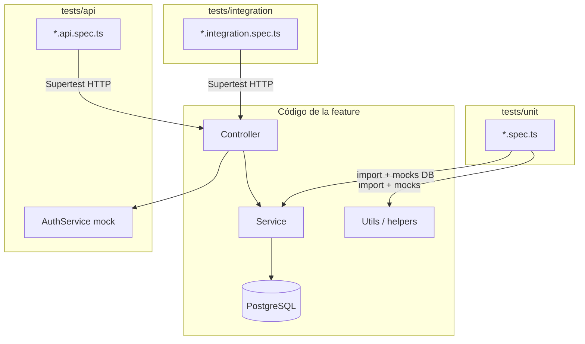

# Arquitectura de tests (backend)

Guía **general** del patrón de tests por feature en mia-system. Todas las features deben seguir la misma estructura; **auth** es el ejemplo de referencia ya implementado.

Stack: **Jest** + **ts-jest** + **Supertest** (HTTP) + **@nestjs/testing**.

---

## 1. Dónde viven los tests

### Features (`backend/src/<feature>/`)

Cada feature tiene su propia carpeta `tests/` con tres alcances:

```
backend/src/<feature>/
├── <feature>.controller.ts
├── <feature>.service.ts
├── dto/
├── …
└── tests/
    ├── unit/           ← lógica aislada (mocks)
    ├── api/            ← contrato HTTP (service mockeado)
    └── integration/    ← flujo real (Postgres, sin mock del service)
```

Ejemplo real (`auth`):

```
backend/src/auth/tests/
├── unit/
│   ├── auth.service.spec.ts
│   └── jwt-token.util.spec.ts
├── api/
│   ├── auth.login.api.spec.ts
│   └── auth.login.rate-limit.api.spec.ts
└── integration/
    ├── auth-integration.helper.ts
    ├── auth.login.integration.spec.ts
    ├── auth.refresh.integration.spec.ts
    └── auth.logout.integration.spec.ts
```

### Common / utils (fuera de feature)

Utilidades compartidas llevan el spec **colocalizado** junto al archivo:

```
backend/src/common/utils/
├── rut.util.ts
├── rut.util.spec.ts
├── upload-validation.util.ts
└── upload-validation.util.spec.ts
```

No usan `tests/unit|api|integration` porque no son un feature de dominio.

---

## 2. Qué prueba cada capa

| Capa | Carpeta | ¿DB? | ¿Qué valida? | Dependencias |
|------|---------|------|--------------|--------------|
| **Unit** | `tests/unit/` | No | Funciones, services, parsers con **mocks** | Mocks de DB / otros services |
| **API** | `tests/api/` | No | Contrato HTTP: DTO, status, body, rate limit | Controller real + **service mock** + ValidationPipe + filter |
| **Integration** | `tests/integration/` | **Sí** | Flujo de punta a punta del feature con datos reales | Módulo real + Postgres (+ seeds) |

### Unit

- Importa el código de la feature (`../../auth.service`, `../../jwt-token.util`, etc.).
- Sustituye infra (`DatabaseService`, etc.) con `useValue: { … }`.
- Sirve para reglas puras y regresiones baratas.

### API (contrato)

- Monta un `TestingModule` mínimo: controller + mock del service.
- Supertest hace `POST /auth/login` (sin prefijo global `/api` en este módulo de test).
- Valida qué **acepta** el body y qué **devuelve** (shape, 400, 401, 429).
- **No** prueba que las credenciales existan en BD.

### Integration

- Importa el módulo real del feature (`AuthModule`) + `DatabaseModule`.
- Usa seeds de `migrate:data` (p. ej. `admin@mia.local` / `admin`) o factories.
- Assert también en BD (p. ej. fila en `refresh_sessions`).
- Rate limit suele desactivarse aquí (ya cubierto en `api/`).

---

## 3. Cómo se “comunican” los unitarios con la feature

No hay un bus especial: son imports relativos al código de producción.

```text
tests/unit/auth.service.spec.ts
        │
        │  import { AuthService } from '../../auth.service'
        │  import { … } from '../../jwt-token.util'
        ▼
src/auth/auth.service.ts   ← mismo código que corre en runtime
```

Flujo típico de un unit test Nest:

```text
Jest carga *.spec.ts
    → Test.createTestingModule({ providers: [AuthService, mocks…] })
    → module.get(AuthService)
    → llama métodos y hace expect(…)
```

La feature **no** registra los tests; Jest los descubre por nombre de archivo (`*.spec.ts`) bajo `backend/src` (`rootDir: "src"` en la config Jest del `package.json`).

---

## 4. Cómo se lanzan (comandos)

Todo desde el servicio **`api`** con Compose arriba (raíz del repo).

### Stack levantado

```bash
docker compose up -d
# (si aún no): docker compose exec api pnpm run migrate
# (si aún no): docker compose exec api pnpm run migrate:data
```

### Comandos de test

| Objetivo | Comando |
|----------|---------|
| Todos los unit + api (sin integration) | `docker compose exec api pnpm test` |
| Auth: unit + api | `docker compose exec api pnpm test:auth` |
| Auth: solo integration (necesita BD + seeds) | `docker compose exec api pnpm test:auth:integration` |
| Utils common (ejemplo) | `docker compose exec api pnpm test -- --testPathPatterns=common/utils` |

En el host (carpeta `backend/`), los mismos scripts `pnpm test`, `pnpm test:auth`, etc., si tienes Node/pnpm y, para integration, `DATABASE_URL` apuntando a Postgres.

### Cómo se define un comando

En `backend/package.json`:

```json
"test": "jest",
"test:auth": "jest --testPathPatterns='auth/tests/(unit|api)'",
"test:auth:integration": "jest --runInBand --testPathIgnorePatterns=/node_modules/ --testPathPatterns=auth/tests/integration"
```

- `pnpm test:auth` → pnpm ejecuta el script → Jest filtra paths que matchean el patrón.
- La distinción **no** es por tipo mágico: es por **ruta** (`auth/tests/unit`, `auth/tests/api`, …).
- `pnpm test` ignora `tests/integration/` (`testPathIgnorePatterns`) para no exigir Postgres en el día a día ni romper CI sin setup.

Patrón a replicar en otra feature (ej. `tickets`):

```json
"test:tickets": "jest --testPathPatterns='tickets/tests/(unit|api)'",
"test:tickets:integration": "jest --runInBand --testPathIgnorePatterns=/node_modules/ --testPathPatterns=tickets/tests/integration"
```

---

## 5. Gráfico de alcances



### Pirámide / alcance

```text
                    ┌─────────────────────┐
                    │   integration       │  Pocos, caros, con BD
                    │   (flujo real)      │
                    └──────────┬──────────┘
                               │
                    ┌──────────▼──────────┐
                    │   api / contrato    │  HTTP + DTO + status
                    │   (service mock)    │
                    └──────────┬──────────┘
                               │
                    ┌──────────▼──────────┐
                    │   unit              │  Muchos, rápidos, mocks
                    │   (lógica aislada)  │
                    └─────────────────────┘
```

| Pregunta | Capa |
|----------|------|
| ¿Esta función valida el RUT / el JWT payload? | unit |
| ¿Login acepta este body y responde este JSON/status? | api |
| ¿Login con seed crea sesión en `refresh_sessions`? | integration |

---

## 6. CI (GitHub Actions)

En PRs a `develop` / `main` (`.github/workflows/backend-tests.yml`):

1. `pnpm test` → unit + api (sin carpeta integration).
2. Service **Postgres 16** + `migrate` + `migrate:data`.
3. `pnpm test:auth:integration`.

Node alineado con Docker: **22.22**. Runner: **ubuntu-26.04**.

---

## 7. Checklist al agregar tests a una feature nueva

1. Crear `tests/unit`, `tests/api`, `tests/integration`.
2. Specs con sufijo `.spec.ts` (Jest los detecta).
3. Empezar por unit de utils/services con lógica propia.
4. API de los endpoints críticos (happy + validación + errores de dominio).
5. Integration de 1–2 flujos con seed o factory.
6. Scripts `test:<feature>` y `test:<feature>:integration` en `package.json`.
7. Documentar el seed/fixture que usa integration.

---

## Referencias rápidas

| Recurso | Ruta |
|---------|------|
| Config Jest | `backend/package.json` → `"jest"` |
| Ejemplo feature | `backend/src/auth/tests/` |
| Utils common | `backend/src/common/utils/*.spec.ts` |
| Seeds login | `backend/BD/data-migration/users.sql` / `backend/BD/README.md` |
| Workflow CI | `.github/workflows/backend-tests.yml` |
